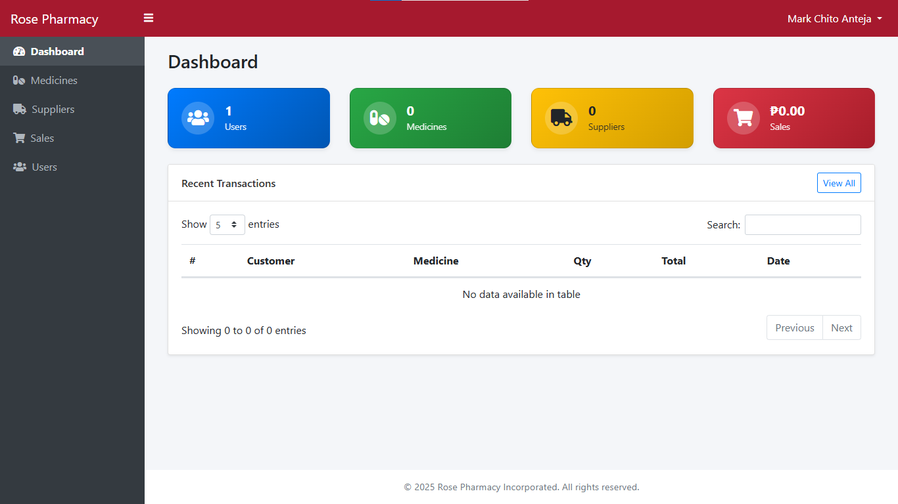

# 🌹 Rose Pharmacy Management System

A lightweight pharmacy management system built with **PHP (OOP)**,
**MySQL**, and **Bootstrap 4**, designed for small pharmacies to handle
medicine inventory, employee access, and secure logins.

------------------------------------------------------------------------

## 🚀 Features

-   Secure login with role-based access control.
-   Admin is also the pharmacist/doctor (small-scale setup).
-   Medicine stock and sales management.
-   Error logging system.
-   User-friendly design with Bootstrap 4.
-   First-time instructions popup for easy onboarding.

------------------------------------------------------------------------

## 🖥️ Requirements

-   Windows 10 or 11\
-   [XAMPP](https://www.apachefriends.org/download.html) (PHP 7.4+
    recommended)\
-   Modern web browser (Chrome, Edge, Firefox)

------------------------------------------------------------------------

## ⚙️ Installation Guide (Windows + XAMPP)

### Step 1: Install XAMPP

1.  Download XAMPP from [Apache
    Friends](https://www.apachefriends.org/download.html).\
2.  Install it on your `C:\` drive (default path: `C:\xampp`).\
3.  Open **XAMPP Control Panel** and start:
    -   **Apache**
    -   **MySQL**

------------------------------------------------------------------------

### Step 2: Get the Project

You have **two options**:

#### Option A: Download as ZIP (recommended for most users)

1.  Click **Code → Download ZIP** from the repository.\

2.  Extract the ZIP file.\

3.  Rename the extracted folder to:

        Rose-Pharmacy-Management-System

4.  Move this folder into:

        C:\xampp\htdocs\

#### Option B: Clone with Git (for developers)

If you prefer Git:

``` bash
cd C:\xampp\htdocs\
git clone https://github.com/your-repo/Rose-Pharmacy-Management-System.git
```

So your project path will look like:

    C:\xampp\htdocs\Rose-Pharmacy-Management-System\

------------------------------------------------------------------------

### Step 3: Configure the Database

1.  Open your browser and go to: <http://localhost/phpmyadmin>.\
2.  Click on **Databases** → create a new database:
    -   Name: `rose_pharmacy_management_system`\
    -   Collation: `utf8mb4_general_ci`\
3.  The system will automatically create tables on first run (thanks to
    `Database.php`).

------------------------------------------------------------------------

### Step 4: Configure Environment File

1.  Inside the project folder, find the file named `.env`.\

2.  Update values if needed:

    ``` env
    APP_URL=http://localhost/Rose-Pharmacy-Management-System
    DB_DATABASE=rose_pharmacy_management_system
    DB_USERNAME=root
    DB_PASSWORD=
    ```

    > ⚠️ Default XAMPP credentials:
    > -   Username: `root`\
    > -   Password: *(leave blank)*

------------------------------------------------------------------------

### Step 5: Run the Application

1.  Open your browser and go to:

        http://localhost/Rose-Pharmacy-Management-System

2.  You'll see the login page.

------------------------------------------------------------------------

### Step 6: First Login

Default admin credentials are:\
- **Username:** `admin`\
- **Password:** `admin123`

> ✅ Change the password after your first login.

------------------------------------------------------------------------

## 📸 Screenshots

### 🔐 Login Page


### 📊 Dashboard



------------------------------------------------------------------------

## 🛠️ Troubleshooting

-   **Apache or MySQL won't start:**
    -   Close apps using ports 80 or 3306 (Skype, IIS, another MySQL
        service).\
    -   Or change ports in XAMPP settings.\
-   **Broken login page:**
    -   Make sure you're visiting the URL, not opening an HTML file.\

    -   Correct link:

            http://localhost/Rose-Pharmacy-Management-System
-   **Database is empty:**
    -   Ensure you created `rose_pharmacy_management_system` in
        phpMyAdmin.\
    -   Reload the page --- tables are auto-created if missing.

------------------------------------------------------------------------

## 📧 Support

For help, contact the system developer or check project documentation.
