# 🌹 JIAN's Pharmacy Inventory & POS Management System

A fully functional **Pharmacy Inventory and Stock Management System with
POS (Point of Sale)** built using **PHP (OOP)**, **MySQL**, and
**Bootstrap 4**.\
Designed for small to medium-sized pharmacies to efficiently manage
medicines, stock levels, employee access, and daily sales.

------------------------------------------------------------------------

## 🎯 Project Goal

The goal of this system is to develop a **complete pharmacy inventory
and stock management system** with an integrated **POS (Point of Sale)**
feature.

### Core Objectives:

-   Two separate dashboards:
    -   **Admin Dashboard**
    -   **Pharmacist Dashboard**
-   **Role-based access** --- Admin has full access, while the
    Pharmacist has limited permissions.
-   **Real-time notifications** for completed transactions.
-   **Secure login and logout** system.
-   **Clean UI and UX** for a smooth user experience.

------------------------------------------------------------------------

## 👨‍💼 System Roles & Permissions

### 🧭 Admin

-   Has **full access** to all system features.
-   Manage **stocks, inventory, and supplier contact** details.
-   Monitor **daily sales and transactions** done by pharmacists.
-   View and manage **system users and access logs**.
-   **Generate sales reports** and export/print them as PDF.
-   Receive alerts when:
    -   Stock levels are low.
    -   Products have poor or declining sales.

### 💊 Pharmacist

-   Can **write and update descriptions** for medicines.
-   Can **post announcements or notes** for other users (e.g., daily
    tasks).
-   Assist customers in purchasing medicines and **print receipts**.
-   Apply **discounts** (Senior Citizen, PWD, etc.) as per law.
-   Handle both **OTC (Over-the-Counter)** and **Non-OTC** medicines ---
    just like a real pharmacy workflow.

------------------------------------------------------------------------

## 🚀 Key Features

-   Secure **login and logout** with role-based access control.
-   **POS (Point of Sale)** interface for pharmacists.
-   **Automatic stock management** with low-stock alerts.
-   **PDF report generation** for sales and inventory.
-   **Notification popups** for completed transactions.
-   Clean and responsive **Bootstrap 4** UI.
-   Built-in **error logging** system.
-   **First-time setup guide** popup for new users.

------------------------------------------------------------------------

## 🖥️ System Requirements

-   **Operating System:** Windows 10 or 11\
-   **Server:** [XAMPP](https://www.apachefriends.org/download.html)
    (PHP 7.4+ recommended)\
-   **Database:** MySQL\
-   **Browser:** Chrome, Edge, or Firefox

------------------------------------------------------------------------

## ⚙️ Installation Guide (Windows + XAMPP)

### Step 1: Install XAMPP

1.  Download XAMPP from [Apache
    Friends](https://www.apachefriends.org/download.html).
2.  Install to default path: `C:\xampp`
3.  Open **XAMPP Control Panel** → Start:
    -   **Apache**
    -   **MySQL**

------------------------------------------------------------------------

### Step 2: Get the Project

#### Option A: Download as ZIP (recommended)

1.  Click **Code → Download ZIP** from the repository.

2.  Extract the ZIP file.

3.  Rename the folder to:

        JIAN's-Pharmacy-Management-System

4.  Move it to:

        C:\xampp\htdocs\

#### Option B: Clone with Git (for developers)

``` bash
cd C:\xampp\htdocs\
git clone https://github.com/your-repo/JIAN's-Pharmacy-Management-System.git
```

Your project path should now be:

    C:\xampp\htdocs\JIAN's-Pharmacy-Management-System\

------------------------------------------------------------------------

### Step 3: Configure the Database

1.  Open [phpMyAdmin](http://localhost/phpmyadmin).
2.  Create a new database:
    -   **Name:** `JIAN's_pharmacy_management_system`
    -   **Collation:** `utf8mb4_general_ci`
3.  The system will **auto-create tables** upon first run (via
    `Database.php`).

------------------------------------------------------------------------

### Step 4: Environment Setup

Inside the project folder, find `.env` and update as needed:

``` env
APP_URL=http://localhost/JIAN's-Pharmacy-Management-System
DB_DATABASE=JIAN's_pharmacy_management_system
DB_USERNAME=root
DB_PASSWORD=
```

> ⚠️ **Default XAMPP credentials:**\
> Username: `root`\
> Password: *(leave blank)*

------------------------------------------------------------------------

### Step 5: Run the Application

Visit:

    http://localhost/JIAN's-Pharmacy-Management-System

You'll see the login page.

------------------------------------------------------------------------

### Step 6: First Login

**Default Admin Credentials:** - **Username:** `admin` - **Password:**
`admin123`

> ✅ Please change the password after your first login.

------------------------------------------------------------------------

## 📸 Screenshots

### 🔐 Login Page


### 🏠 Dashboard

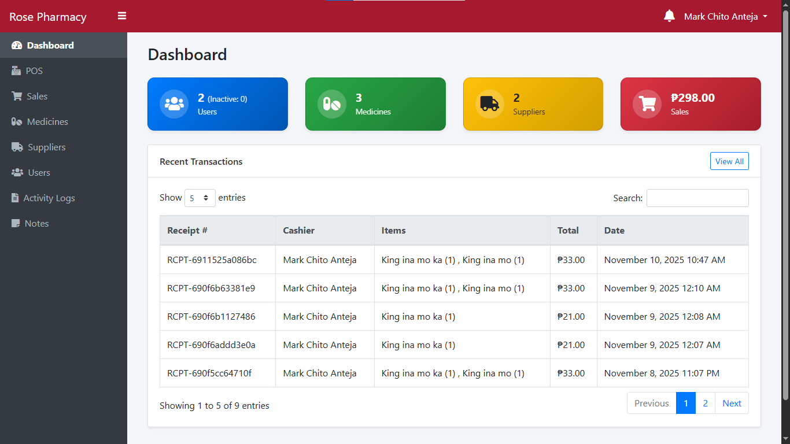

### 👥 Users Management

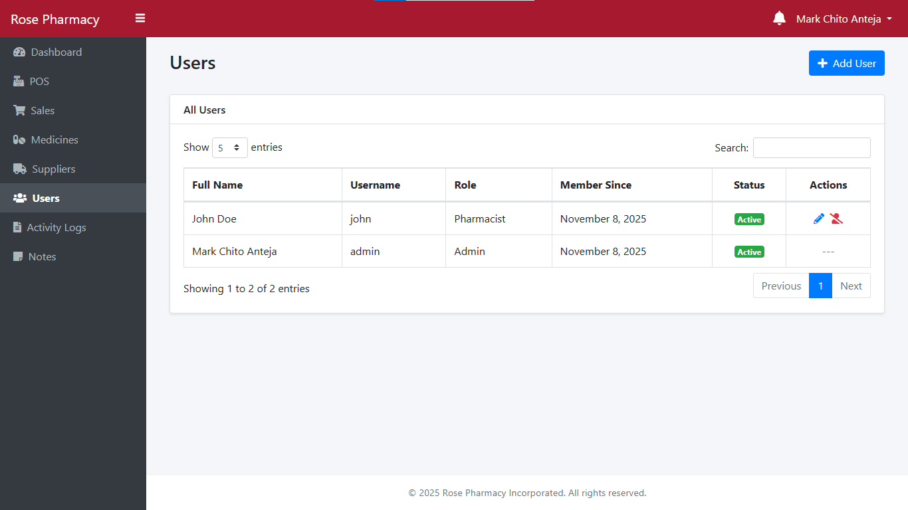

### 💊 Medicines Inventory

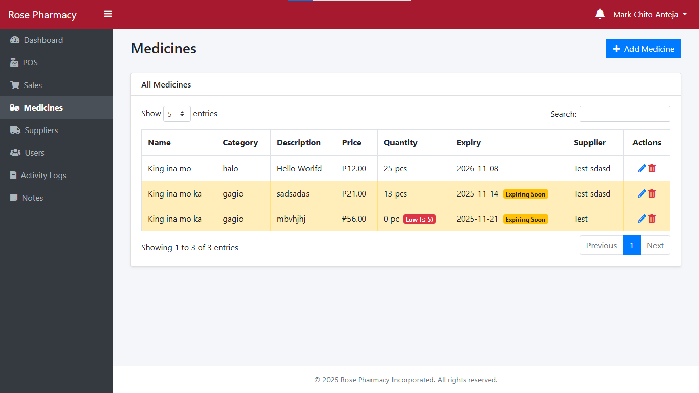

### 🧾 POS Interface

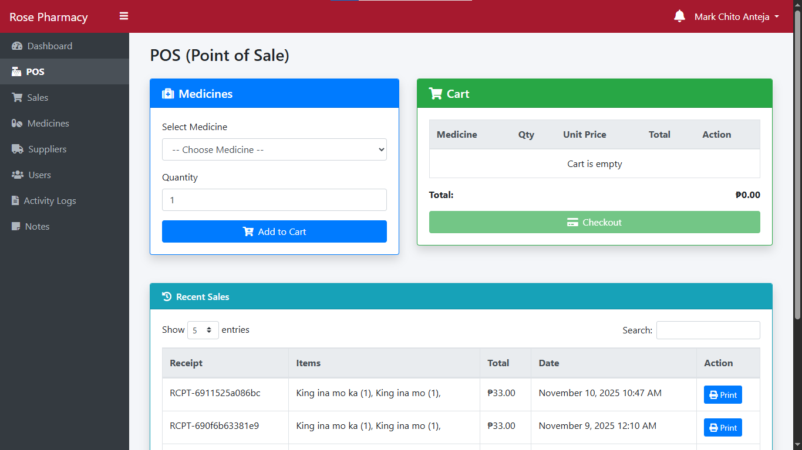

### 🧑‍⚕️ Pharmacist Page

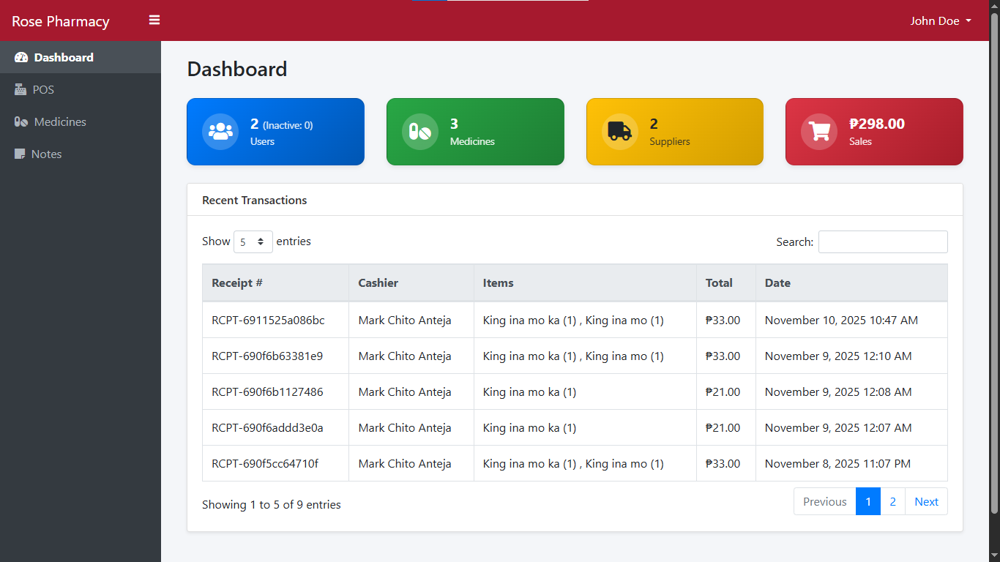

### 🗒️ Notes

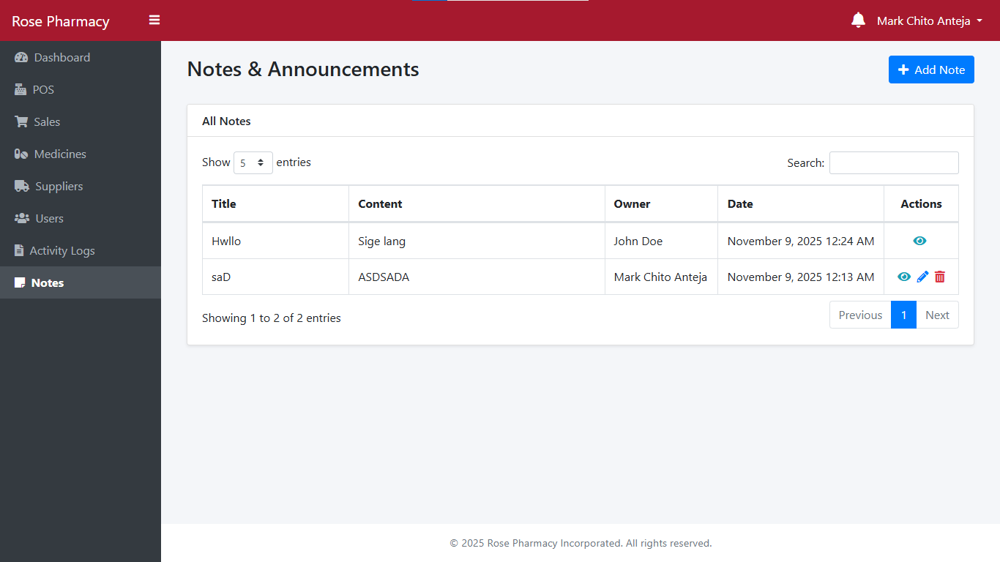

### 🔔 Notifications

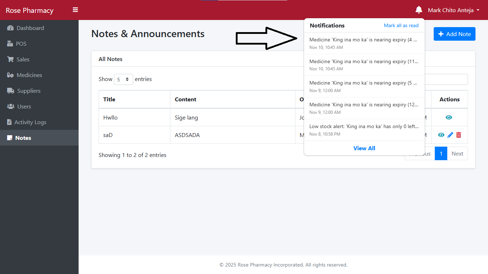

### 🧑‍💼 Suppliers

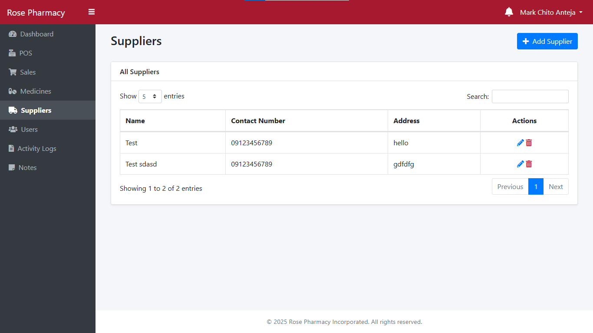

### 📈 Sales Report

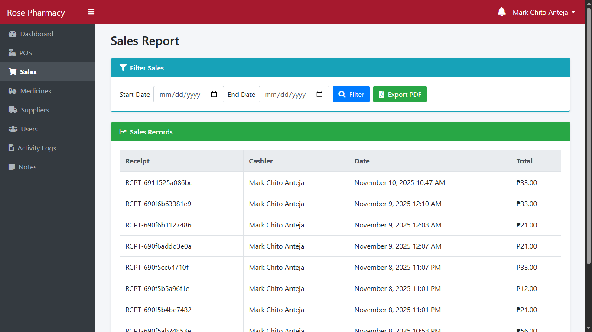

### ⚙️ Account Settings

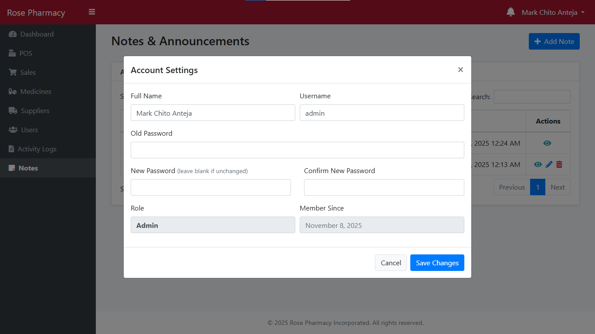

### 📜 Activity Logs

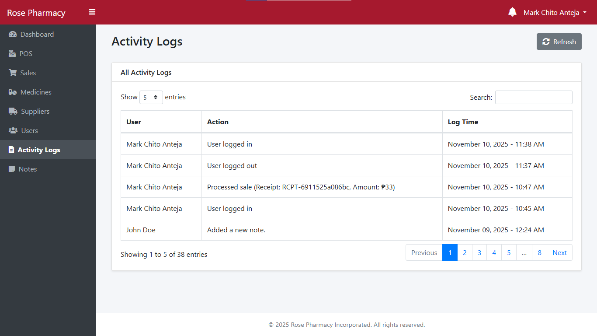

### 🏢 About Us

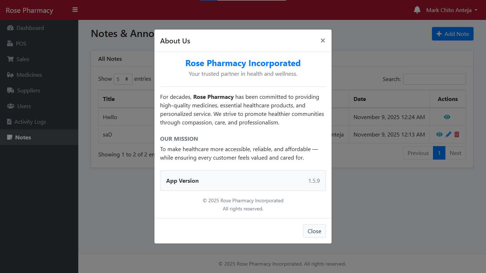

------------------------------------------------------------------------

## 🧩 Troubleshooting

**Apache/MySQL won't start:** - Close conflicting apps (Skype, IIS,
MySQL services). - Or change ports in XAMPP settings.

**Broken login page:** - Access via:
`http://localhost/JIAN's-Pharmacy-Management-System` (Don't open the HTML
file directly.)

**Database empty or missing:** - Make sure you created
`JIAN's_pharmacy_management_system` in phpMyAdmin. - Reload the app ---
tables are auto-generated if missing.

------------------------------------------------------------------------

## 📄 Developer Notes

This project is designed to mimic a **real-world pharmacy environment**,
focusing on: - Efficiency in transaction handling. - Role-based data
integrity. - Readable and maintainable OOP PHP codebase.

------------------------------------------------------------------------

## 📧 Support

For help, contact the system developer or refer to the documentation.
